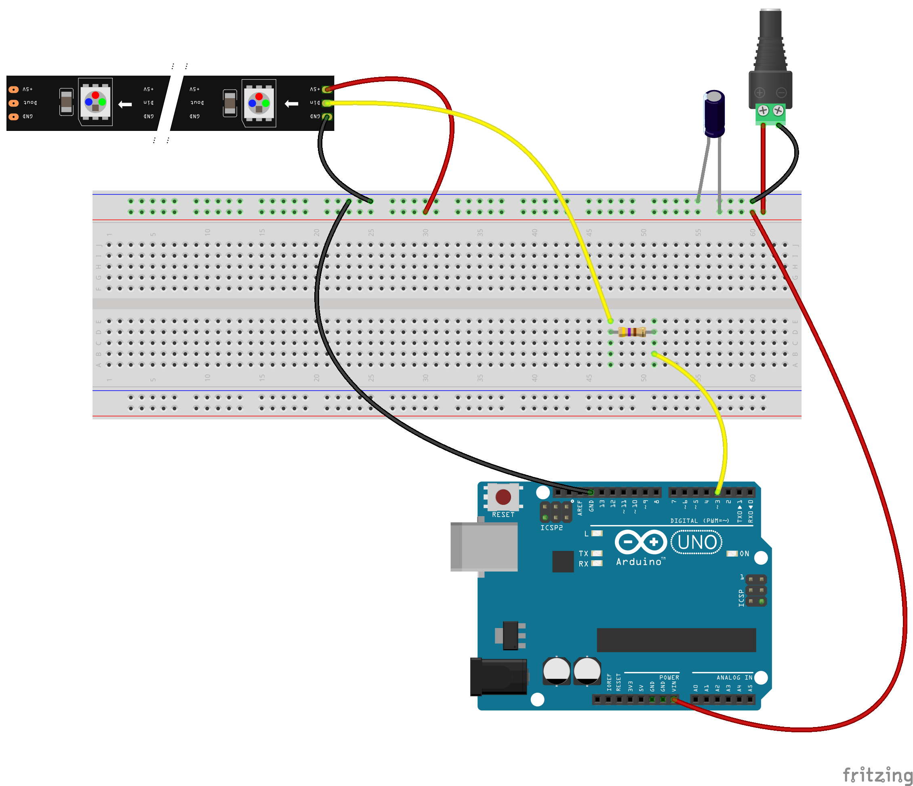

# blinkenlichten @hbk-bs


- [blinkenlichten @hbk-bs](#blinkenlichten-hbk-bs)
  - [FastLED Starter](#fastled-starter)
    - [Gotchas to know about LEDs and FastLED](#gotchas-to-know-about-leds-and-fastled)
      - [RGB vs HSV](#rgb-vs-hsv)
      - [Common Ground](#common-ground)
      - [Power Supply](#power-supply)

## FastLED Starter

Starter sketch to get up and running with the [FastLED](https://github.com/FastLED/FastLED) library and the LEDs we have currently at @hbk-bs (WS2811 Color Order RGB).

> [!IMPORTANT]
>
> - Make sure to install the FastLED library in the Arduino IDE.
> - Make sure to install the Board definition for the Arduino Uno R4 in the Arduino IDE.
> - Make sure to adjust the `NUM_LEDS` to the number of LEDs you are using.
> - Make sure to adjust the `DATA_PIN` to the pin you are using.



### Gotchas to know about LEDs and FastLED

#### RGB vs HSV

Even when it has HSV built in it uses a range of 0 to 255 for all the values rather then 360, 100, 100 what we are used from using p5.js or Processing. Here are two sketches (p5.js and Processing) to convert these colors.

```js
let h = 330;
let s = 80;
let b = 80;

function setup() {
	createCanvas(400, 400);
	colorMode(HSB, 360, 100, 100);
	let c = color(h, s, b);

	background(c);
	fill(0); // black text
	text(`H: ${floor(map(h, 0, 360, 0, 255))}`, 10, 10);
	text(`S: ${floor(map(s, 0, 360, 0, 255))}`, 10, 30);
	text(`B: ${floor(map(b, 0, 360, 0, 255))}`, 10, 50);
}
```

Same thing for Processing.

```java
float h = 330;
float s = 80;
float b = 80;
colorMode(HSB, 360, 100, 100);
color c = color(h,s,b);

background(c);
text("H: "+floor( map(h, 0, 360, 0, 255)), 10, 20);
text("S: "+floor( map(s, 0, 360, 0, 255)), 10, 40);
text("B: "+ floor(map(b, 0, 360, 0, 255)), 10, 6
```

#### Common Ground

When using an external power supply the LEDs, the board and the supply need to be connected on their GND (it is called common ground). If not the LEDs will be wonky.

#### Power Supply

We currently have 5V 2A power supplies at hand. This means we can run around 30 LEDs at full capacity. If you need more LEDs add more Amps.

```plain
Total length: 40 meters
Light source: F8 RGB with integrated WS2811 IC
Number of LEDs: 50 LEDs per strand
Operating voltage: DC 5V
Power: 0.3 W per LED
Lamp spacing: 8cm
Hole diameter: 12 mm
Connection: Red: +5V; White: DATA; Blue: GND


Current per LED = 0,3W ÷ 5V = 0,06A = 60mA
50 LEDS × 60 mA ÷ 1,000 = 3 Amps minimum
30 LEDS × 60 mA ÷ 1,000 = 1.8 Amps minimum
```

- LEDS: https://amzn.eu/d/d1sZh2n
- Power Supply: https://amzn.eu/d/efzY4bn

To learn more about connecting LEDs (why the capacitor on the power supply, why the resistor on the data pin) read Adafruits [LED überguide!](https://learn.adafruit.com/adafruit-neopixel-uberguide/powering-neopixels)
